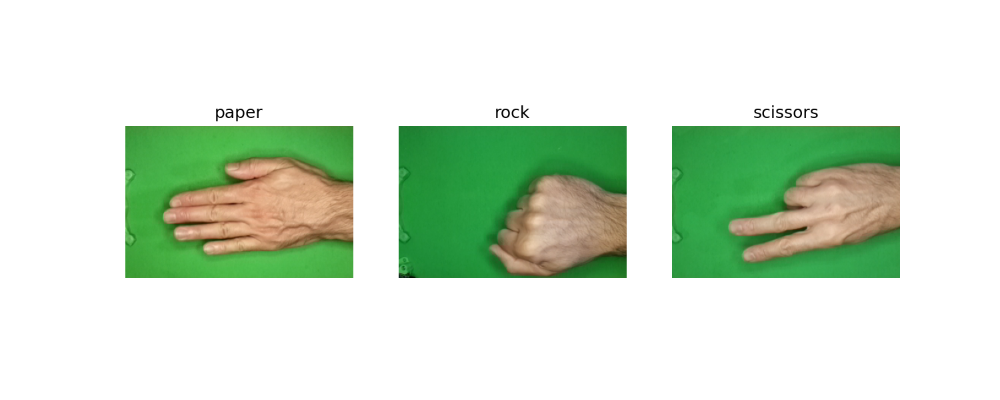

# Image Classification (PyTorch) — Rock–Paper–Scissors

PyTorch project for classifying Rock–Paper–Scissors hand gesture images using Convolutional Neural Networks (CNNs). Includes data preprocessing, model training, evaluation, and hyperparameter tuning.

<p align="center">
  
</p>


## Project structure

```
├── LICENSE            <- Open-source license if one is chosen
├── README.md          <- The top-level README for developers using this project.
├── data
│   ├── processed      <- The final, canonical data set split for modeling.
│   └── data_rps       <- The original, immutable data dump.
│
├── docs               <- A default mkdocs project; see www.mkdocs.org for details
│
├── models             <- Trained and serialized models, model predictions, or model summaries
│
├── notebooks          <- Jupyter notebooks: `data-exploration`.
│
├── pyproject.toml     <- Project configuration file with package metadata for 
│                         rps_classification
│
├── references         <- Explanatory materials.
│
├── reports            
│   └── figures        <- Generated graphics and figures to be used in reporting
│
├── requirements.txt   <- The requirements file for reproducing the analysis environment, 
│                         generated with `pip freeze > requirements.txt`
│
└── rps_classification   <- Source code for use in this project.
    │
    ├── __init__.py             <- Makes rps_classification a Python module
    │
    ├── config.py               <- Store useful variables and configuration
    │
    ├── dataset.py              <- Scripts to generate train, val, test split from raw data
    │
    ├── data_utils.py             <- Code to create load and transform data
    │
    ├── modeling                
    │   ├── __init__.py 
    │   ├── predict.py          <- Code to run model inference with trained models          
    │   └── train.py            <- Code to train and evaluate models
    │
    └── plots.py                <- Code to create visualizations
```


## Dataset
Download the Rock-Paper-Scissors dataset from Kaggle: https://www.kaggle.com/datasets/drgfreeman/rockpaperscissors.

Copy it into: `data/data_rps`.


## Requirements & Environment Setup

This project uses uv as the package and environment manager for Python. The following steps are required to correctly set up a working environment and run the project locally.

```bash
uv sync
source .venv/Scripts/activate
uv run python -c "import sys; print(sys.executable)"

### to check if torch version correct
python -c "import torch; print(torch.__version__, torch.cuda.is_available())"

per disattivarlo:
deactivate
rm -rf .venv
```
The project was developed and executed locally with GPU acceleration on the following configuration:

| Component        | Specification                 |
| ---------------- | ----------------------------- |
| Operating System | Windows 10                    |
| Python Version   | 3.12                          |
| PyTorch Version  | 2.5.1+cu121 (CUDA 12.1)       |
| CUDA Version     | 13.0 (driver level support)   |
| GPU              | NVIDIA GeForce GTX 1660 (6GB) |
| NVIDIA Driver    | 580.88                        |

> ### Note on Hardware Performance
> The experiments for this project were executed locally on a consumer GPU (**NVIDIA GeForce GTX 1660**). This GPU belongs to a comparable performance class to the **NVIDIA T4**.
> Therefore, the results of this project should be **reproducible on a Google Colab T4 runtime or similar CUDA-enabled environment** with minimal differences in training time.
